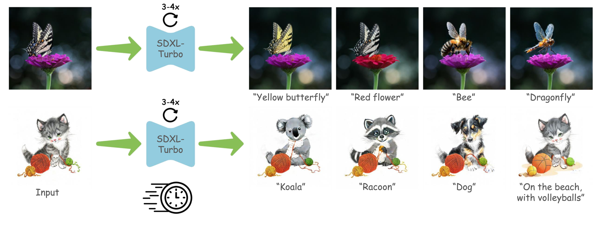

# TurboEdit: Text-Based Image Editing Using Few-Step Diffusion Models
### SIGGRAPH Asia 2024

[](https://arxiv.org/abs/2408.00735)

[[Project Website](https://turboedit-paper.github.io/)]





> **TurboEdit: Text-Based Image Editing Using Few-Step Diffusion Models**<br>
> Gilad Deutch<sup>1</sup>, Rinon Gal<sup>1,2</sup>, Daniel Garibi <sup>1</sup>, Or Patashnik<sup>1</sup>, Daniel Cohen-Or<sup>1</sup> <br>
> <sup>1</sup>Tel Aviv University, <sup>2</sup>NVIDIA

>**Abstract**: <br>
> Diffusion models have opened the path to a wide range of text-based image
editing frameworks. However, these typically build on the multi-step nature
of the diffusion backwards process, and adapting them to distilled, fast-
sampling methods has proven surprisingly challenging. Here, we focus
on a popular line of text-based editing frameworks - the “edit-friendly”
DDPM-noise inversion approach. We analyze its application to fast sampling
methods and categorize its failures into two classes: the appearance of
visual artifacts, and insufficient editing strength. We trace the artifacts to
mismatched noise statistics between inverted noises and the expected noise
schedule, and suggest a shifted noise schedule which corrects for this offset.
To increase editing strength, we propose a pseudo-guidance approach that
efficiently increases the magnitude of edits without introducing new artifacts.
All in all, our method enables text-based image editing with as few as three
diffusion steps, while providing novel insights into the mechanisms behind
popular text-based editing approaches.

## Description
This repo contains the official code for the TurboEdit paper.

## TODO:
- [x] Release code!
- [ ] Add support for prompt-to-prompt

## Setup

Our code is built on the diffusers library.
```
pip install -r requirements.txt
```
Note that the code may still run with versions different than the ones specified in the ```requirements.txt```, but may produce different results.

## Edit
To perform inference, put your images in a folder and create a json file with the source and target prompts (similarly to our ```dataset/dataset.json``` file) and run -
```
python main.py --prompts_file="dataset/dataset.json"
```
You can experiment with ```--fp16 --timesteps=3``` for faster inference, and possibly results that are somewhat less good.

You can experiment with ```--w=GUIDANCE_VAL``` for stronger/weaker alignment with the target prompt (where ```--w=0``` means to not guide the input image at all, i.e. not change it).

### Gradio demo
Alternatively, if you want to experiment using [Gradio](https://www.gradio.app/)'s UI, run -
```
python app.py 
```

## EF-DDS Equivalence
To reproduce our results showing the equivalence between EF & DDS, run -
```
python dds_ef_eq.py --num_iters 64 --t_min 1 --t_max 632 --seed 2 --guidance_scale_source 3.5 --guidance_scale_target 15 --linear_timestep_annealing --lr_ef --prompts_file ../dataset/dataset.json
```
The ```dds_ef_eq.py``` file is based on the code from the [DDS repo](https://github.com/google/prompt-to-prompt/blob/main/DDS_zeroshot.ipynb), though note that is does not use ```loss.backward()``` and ```optimizer.step()``` as optimization is not required to implement the DDS algorithm.

## Citation

If you make use of our work, please cite our paper:

```
@misc{deutch2024turboedittextbasedimageediting,
      title={TurboEdit: Text-Based Image Editing Using Few-Step Diffusion Models}, 
      author={Gilad Deutch and Rinon Gal and Daniel Garibi and Or Patashnik and Daniel Cohen-Or},
      year={2024},
      eprint={2408.00735},
      archivePrefix={arXiv},
      primaryClass={cs.CV},
      url={https://arxiv.org/abs/2408.00735}, 
}
```
